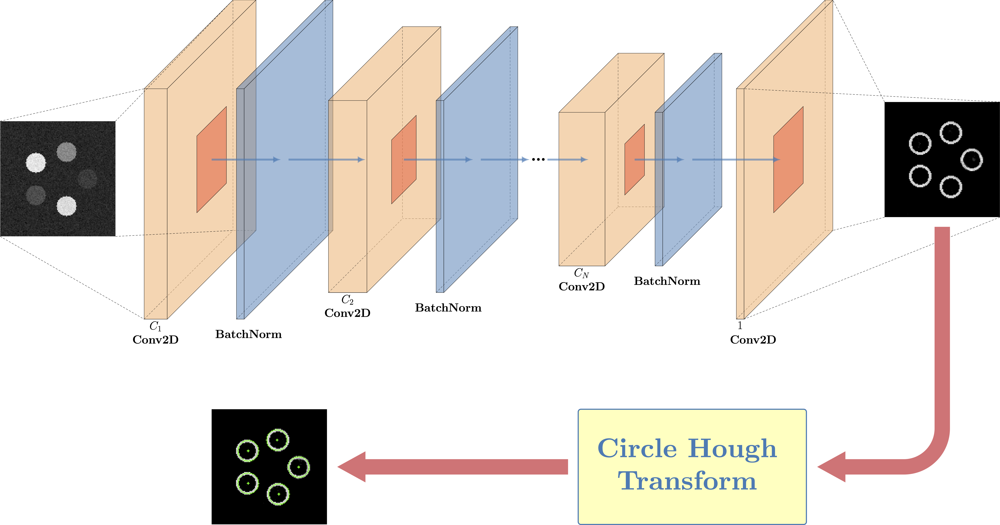
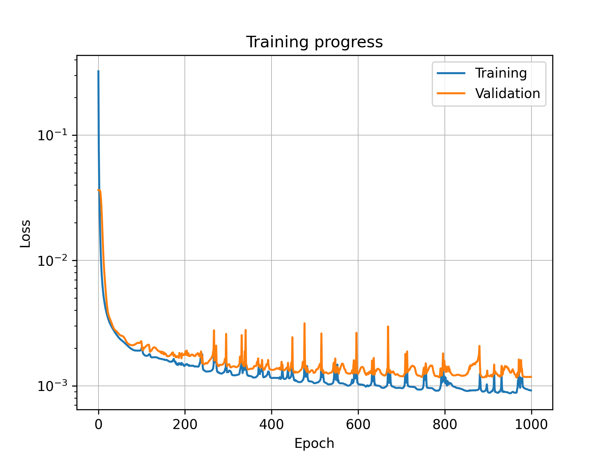

# Hybrid Deep Learning and Feature Detection for Locating Multiple Circular Areas

This repository explores an approach that combines deep learning with conventional feature detection techniques to locate multiple circular areas in an image.  

## Problem Formulation  

Given a grayscale image containing $N_c$ circular bright spot areas, where:  
- $N_c$ is a random number greater than 1.  
- The circular areas vary in brightness.  
- Their positions are randomly distributed within the image domain.  
- The image may contain background noise.

The objective is to develop a model that, when given an input image, accurately returns a list of coordinates corresponding to all detected circular areas.  

## Model Construction Approach  

The process of locating circular areas consists of two key steps:  

1. **Image Denoising and Brightness Normalization**  
   A deep convolutional neural network (CNN) is utilized to denoise the image and transform circular regions of varying brightness into multiple circles with nearly uniform brightness.  

2. **Center Coordinate Extraction**  
   The Circle Hough Transform is applied to extract the coordinates of the centers of these multi-circles.  

<strong>Illustration of the model for detecting multiple circular areas</strong>

 

The following presents the training history and evaluation results for the model configured in `config.yml`:  

  

    
    
<strong>The Training and Validation Loss over Epochs</strong>

  

  
   
  
  

    <table border="1" style="width: 49%;">
      <thead>
        <tr>
          <th>Metric</th>
          <th>Non-Noised Test Data</th>
          <th>Noised Test Data</th>
        </tr>
      </thead>
      <tbody>
        <tr>
          <td><strong>Total Circles</strong></td>
          <td>3,124</td>
          <td>3,079</td>
        </tr>
        <tr>
          <td><strong>Detected Circles</strong></td>
          <td>3,048</td>
          <td>2,975</td>
        </tr>
        <tr>
          <td><strong>Missed Circles</strong></td>
          <td>76</td>
          <td>104</td>
        </tr>
        <tr>
          <td><strong>False Positives</strong></td>
          <td>0</td>
          <td>0</td>
        </tr>
        <tr>
          <td><strong>Detection Rate (%)</strong></td>
          <td>97.57</td>
          <td>96.62</td>
        </tr>
        <tr>
          <td><strong>Precision</strong></td>
          <td>1.00</td>
          <td>1.00</td>
        </tr>
        <tr>
          <td><strong>Recall</strong></td>
          <td>0.98</td>
          <td>0.97</td>
        </tr>
        <tr>
          <td><strong>F1 Score</strong></td>
          <td>0.99</td>
          <td>0.98</td>
        </tr>
      </tbody>
    </table>
    
<strong> Circular Area Detection Performance</strong>

  

